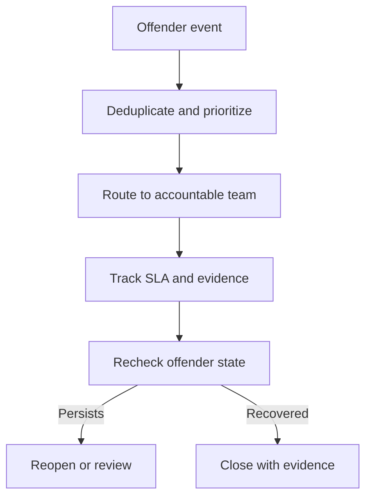
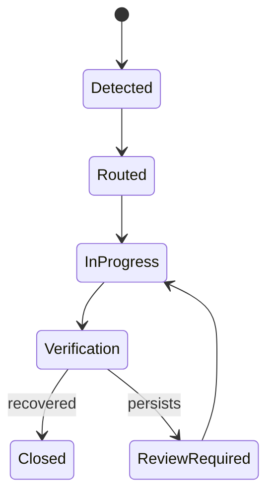

# RDAO — RAN Demand Assurance Orchestrator

Architecture-first specification for turning detected RAN offenders into
traceable operational demands with ownership, SLA, recurrence and closure
assurance.

> This repository currently documents contracts and architecture. It does not
> claim to contain an executable production orchestrator.

## Problem

Detection is only the beginning of an operational loop. A demand can be lost,
closed while the offender persists, duplicated across channels or delayed
without a visible owner. RDAO defines the state and interfaces required to keep
that loop auditable.

## Repository status

| Capability | Status |
|---|---|
| Executive and technical scope | Specified |
| Entity and event contracts | Specified |
| Demand state machine | Specified |
| Synthetic interface examples | Included |
| Local executable MVP | Roadmap |
| External messaging/ticket adapters | Roadmap |
| Production deployment | Out of scope |

## Proposed domain model

- `Offender`: the detected network condition and evidence window.
- `Demand`: ownership, priority, SLA and lifecycle.
- `TicketSnapshot`: external repair-state observation.
- `Treatment`: actions, commentary and evidence.
- `ClosureCheck`: whether the original offender still persists.

## State machine

## Planned MVP

The first executable milestone will use Pydantic contracts, SQLite persistence,
a CLI, synthetic adapters and transition tests. External platform-specific
integrations will remain replaceable adapters.

## Data and safety

All examples are synthetic. The architecture must be implemented with
idempotency, least privilege, immutable audit events and Human-in-the-Loop
review for reopen/escalation actions.

MIT licensed.
