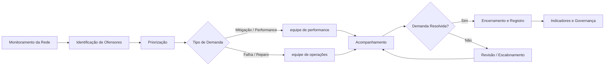

# RDAO — RAN Demand Assurance Orchestrator
## Escopo Executivo

## 1. Visão geral

O **RDAO — RAN Demand Assurance Orchestrator** é uma proposta de automação e orquestração do ciclo de tratamento de demandas originadas no monitoramento da rede de acesso móvel.

A solução organiza, acelera e torna rastreável o fluxo entre:

1. identificação de ofensores;
2. priorização das demandas;
3. encaminhamento para as equipes responsáveis;
4. acompanhamento das ações;
5. revisão de casos não resolvidos;
6. consolidação de resultados e indicadores de gestão.

O objetivo principal é reduzir o tempo entre a detecção de uma anomalia e sua efetiva resolução, diminuindo atividades manuais, retrabalho, perda de informação e atrasos de follow-up.

---

## 2. Problema de negócio

Atualmente, a identificação de ofensores na rede gera demandas que precisam ser analisadas, classificadas, direcionadas, acompanhadas, cobradas, revisadas, encerradas e reportadas.

Quando esse ciclo depende fortemente de planilhas, e-mails e controles manuais, surgem problemas recorrentes:

- aumento do tempo de resposta;
- baixa visibilidade do status real das demandas;
- risco de perda de casos;
- dificuldade para identificar responsáveis;
- retrabalho na consolidação de informações;
- encerramento prematuro de tickets;
- baixa rastreabilidade das decisões;
- dificuldade para medir eficiência e resultado;
- dependência de conhecimento individual.

O RDAO atua como uma camada de coordenação desse processo.

---

## 3. Objetivo estratégico

Transformar um fluxo predominantemente manual em um processo:

- mais rápido;
- mais previsível;
- mais rastreável;
- orientado por prioridade;
- baseado em regras claras;
- auditável;
- escalável;
- preparado para evolução futura com inteligência artificial.

O RDAO não substitui as equipes técnicas. Ele organiza e acelera a interação entre elas.

---

## 4. Escopo funcional executivo

### 4.1 Monitoramento da saúde da rede

O processo começa a partir das fontes existentes de monitoramento de KPIs, KQIs, alarmes, falhas ou listas de ofensores.

O RDAO recebe essas informações e identifica quais elementos exigem acompanhamento.

### 4.2 Identificação e priorização

As demandas são classificadas segundo critérios como:

- criticidade;
- duração;
- recorrência;
- impacto;
- quantidade de usuários afetados;
- importância da localidade;
- SLA;
- tipo de falha;
- histórico do elemento.

A priorização permite tratar primeiro os casos de maior impacto operacional ou de negócio.

### 4.3 Encaminhamento inteligente

Cada demanda é direcionada ao grupo mais adequado.

#### Fluxo equipe de performance

Demandas que exigem análise, proposição de mitigação, ajuste de parâmetros ou avaliação de performance.

#### Fluxo equipe de operações

Demandas relacionadas a falhas de equipamentos ou ações de reparo, normalmente associadas a tickets registrados em plataforma corporativa.

O RDAO organiza o envio, registra o responsável e mantém o vínculo entre ofensor, demanda e ticket.

### 4.4 Acompanhamento das ações

O sistema acompanha o andamento das demandas e verifica mudanças relevantes, como:

- nova ação registrada;
- ticket encerrado;
- mudança de status;
- ausência de retorno;
- prazo próximo do vencimento;
- reincidência do ofensor;
- necessidade de nova análise.

### 4.5 Revisão automática de casos

Quando um ticket deixa de aparecer na listagem de tickets abertos, o RDAO verifica se o elemento ainda permanece ofensor.

Caso o problema persista, o sistema gera uma solicitação de revisão de status.

Essa abordagem reduz o risco de encerramento administrativo sem resolução efetiva da condição observada na rede.

### 4.6 Resultado e visibilidade

A gestão passa a ter visão ponta a ponta sobre:

- demandas criadas;
- demandas abertas;
- demandas em tratamento;
- demandas sem resposta;
- tickets encerrados;
- casos reabertos;
- tempo médio de atendimento;
- tempo médio de resolução;
- reincidência;
- eficiência por equipe;
- criticidade acumulada;
- impacto evitado.

---

## 5. Macroprocesso proposto

---

## 6. Ganhos esperados

### 6.1 Redução do tempo de resposta

A automação reduz o intervalo entre detecção, registro, encaminhamento, cobrança, revisão e resolução.

### 6.2 Redução de atividades manuais

O sistema elimina ou reduz tarefas como:

- copiar e colar informações;
- cruzar planilhas;
- conferir listas manualmente;
- identificar tickets encerrados;
- procurar históricos em e-mails;
- gerar cobranças individuais;
- consolidar indicadores.

### 6.3 Menor retrabalho

A centralização das informações evita divergências entre planilhas, e-mails, tickets e relatórios paralelos.

### 6.4 Maior governança

Cada demanda passa a ter origem, data, prioridade, responsável, histórico, prazo, status, evidências e resultado.

### 6.5 Mais agilidade operacional

As equipes recebem informações mais organizadas e priorizadas, reduzindo o tempo gasto para compreender cada caso.

### 6.6 Melhor qualidade de decisão

A priorização deixa de depender apenas da percepção individual e passa a considerar regras de criticidade e impacto.

### 6.7 Escalabilidade

O processo pode ser aplicado a múltiplas tecnologias, fornecedores, regionais, equipes, indicadores e fluxos de tratamento.

---

## 7. Indicadores de sucesso

### Indicadores operacionais

- tempo entre detecção e envio da demanda;
- tempo entre envio e primeira resposta;
- tempo médio de resolução;
- percentual de demandas dentro do SLA;
- percentual de demandas sem retorno;
- quantidade de revisões solicitadas;
- quantidade de tickets encerrados com ofensor ainda ativo;
- taxa de reincidência.

### Indicadores de produtividade

- quantidade de atividades manuais eliminadas;
- horas economizadas por semana;
- quantidade de demandas tratadas por analista;
- redução do esforço de consolidação;
- redução de e-mails de cobrança manual.

### Indicadores de governança

- percentual de demandas com responsável definido;
- percentual de demandas com evidência;
- percentual de demandas com histórico completo;
- percentual de encerramentos auditáveis;
- aderência às regras de priorização.

### Indicadores de impacto na rede

- redução da duração média dos ofensores;
- redução de recorrência;
- redução da quantidade de elementos críticos;
- melhoria de KPIs após ação;
- redução de impacto acumulado.

---

## 8. Escopo inicial recomendado

### Fase 1 — Orquestração básica

- recepção da lista de ofensores;
- classificação por tipo;
- geração de demanda;
- envio de e-mail;
- registro em base de controle;
- acompanhamento de status;
- dashboards básicos.

### Fase 2 — Controle de tickets equipe de operações

- recepção diária da lista de tickets abertos;
- comparação incremental entre dias;
- identificação de tickets que saíram da lista de abertos;
- consulta do status atual do ofensor;
- geração de pedido de revisão quando necessário.

### Fase 3 — Priorização avançada

- score de criticidade;
- SLA por tipo de demanda;
- recorrência;
- impacto acumulado;
- tratamento diferenciado por região ou serviço.

### Fase 4 — Governança e inteligência

- dashboards gerenciais;
- análise de gargalos;
- previsão de atraso;
- detecção de reincidência;
- recomendação de ação;
- sumarização executiva;
- integração com agentes de IA.

---

## 9. Limites do escopo

O RDAO não deve ser apresentado como:

- substituto das plataformas corporativas;
- substituto das equipes de performance ou operações;
- sistema de decisão autônoma sem governança;
- mecanismo que altera a rede diretamente na fase inicial;
- ferramenta que encerra tickets sem validação;
- solução concorrente aos sistemas oficiais.

O RDAO deve ser apresentado como uma camada de coordenação, automação, priorização, rastreabilidade, governança e visibilidade.

---

## 10. Princípios de governança

1. **Sistema oficial como fonte de verdade:** o RDAO complementa, mas não substitui, as plataformas corporativas.
2. **Rastreabilidade:** toda ação deve ser registrada.
3. **Explicabilidade:** toda prioridade ou recomendação deve apresentar motivo.
4. **Segurança:** o acesso deve respeitar perfis e permissões.
5. **Minimização de dados:** utilizar apenas os dados necessários ao processo.
6. **Human-in-the-loop:** decisões críticas permanecem sob supervisão humana.
7. **Evolução controlada:** a automação deve avançar por etapas.

---

## 11. Principais riscos executivos

### Adoção pelas equipes

**Risco:** percepção de aumento de controle ou burocracia.

**Mitigação:** envolver as equipes desde o início e demonstrar redução de trabalho manual.

### Qualidade dos dados

**Risco:** decisões incorretas por inconsistência das fontes.

**Mitigação:** validações automáticas, regras de qualidade e tratamento de exceções.

### Dependência de e-mail e planilhas

**Risco:** limitações de escala e rastreabilidade.

**Mitigação:** utilizar essas ferramentas no MVP, mas evoluir para bases estruturadas e integrações.

### Excesso de automação

**Risco:** encaminhamentos incorretos ou cobranças indevidas.

**Mitigação:** regras conservadoras, aprovação humana e trilha de auditoria.

### Sobreposição com sistemas existentes

**Risco:** interpretação do projeto como duplicação de plataformas.

**Mitigação:** posicionar o RDAO como camada de orquestração entre sistemas e equipes.

---

## 12. Perguntas executivas antecipadas

### O RDAO substitui algum sistema existente?

Não. Ele conecta e organiza informações já existentes, reduzindo lacunas entre monitoramento, e-mail, planilhas, tickets e acompanhamento.

### Qual é o principal benefício?

Acelerar o ciclo entre detecção, ação e resolução, com menor esforço manual e maior visibilidade.

### É uma ferramenta ou um processo?

É uma solução de orquestração composta por processo, regras, automação, base de controle e camada de visualização.

### Exige investimento elevado?

A primeira versão pode ser implantada com ferramentas já disponíveis, como Power Automate, SharePoint, Microsoft Lists, Excel, Power BI, Python e e-mail corporativo.

### Pode ser implantado por etapas?

Sim. A implantação incremental é recomendada.

### A solução pode escalar nacionalmente?

Sim, desde que as regras, fontes de dados e responsabilidades sejam padronizadas.

### O sistema pode tomar decisões sozinho?

Na fase inicial, não. Ele classifica, recomenda, registra e automatiza tarefas, mantendo supervisão humana.

### Como medir o retorno?

Por redução de horas manuais, redução do tempo de resposta, melhoria do SLA, menor reincidência e maior produtividade.

---

## 13. Roadmap executivo

| Etapa | Objetivo | Resultado esperado |
|---|---|---|
| MVP | Automatizar registro, envio e acompanhamento | Ganho rápido de produtividade |
| Controle de tickets | Detectar encerramentos e solicitar revisão | Redução de encerramentos indevidos |
| Priorização | Ordenar demandas por impacto | Melhor alocação de esforço |
| Dashboards | Gerar visão ponta a ponta | Governança gerencial |
| Inteligência | Recomendar ações e prever riscos | Decisão assistida |
| Escala | Expandir para outras regionais e tecnologias | Padronização nacional |

---

## 14. Proposta de valor

> O RDAO transforma um fluxo fragmentado e manual em um processo coordenado, rastreável e orientado por prioridade, reduzindo o tempo entre a identificação de um problema na rede e sua efetiva resolução.

---

## 15. Mensagem para apresentação executiva

O valor do RDAO não está apenas em automatizar e-mails ou planilhas.

O valor está em criar uma camada de governança operacional capaz de identificar, priorizar, distribuir, acompanhar, revisar, escalar, medir e aprender com o histórico.

Essa camada permite que as equipes concentrem mais tempo na análise e solução dos problemas e menos tempo na administração manual do processo.
