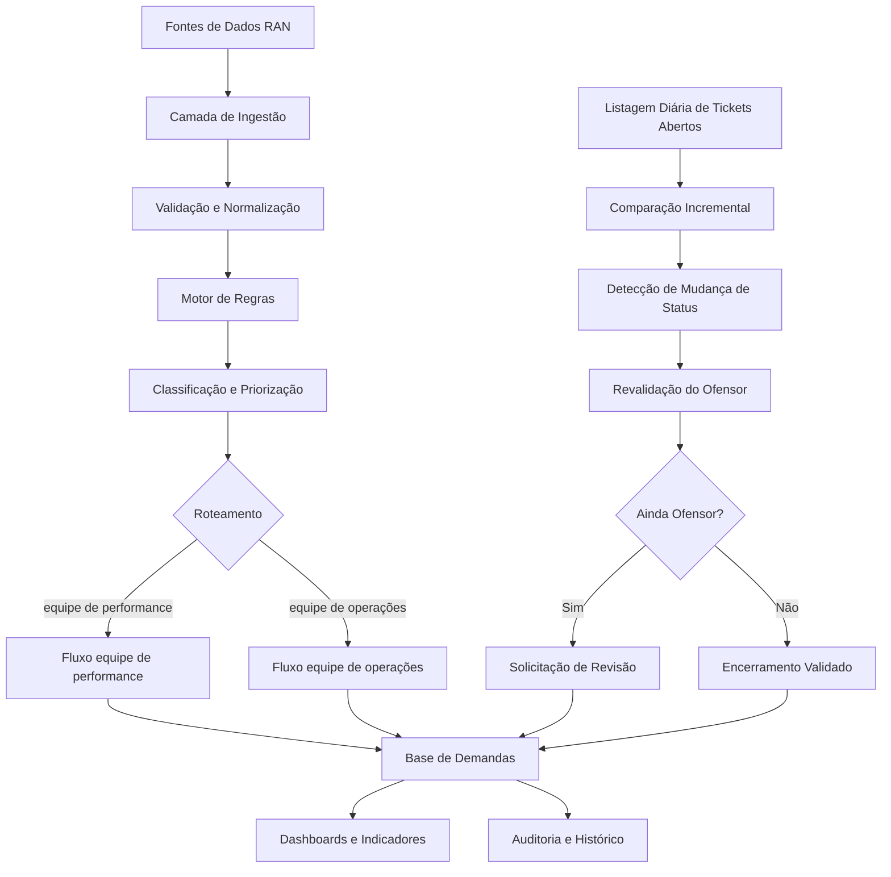

# RDAO — RAN Demand Assurance Orchestrator
## Escopo Técnico e Proposta de Implementação

## 1. Objetivo técnico

O RDAO é uma arquitetura de automação e orquestração destinada a controlar o ciclo de vida das demandas geradas a partir de ofensores identificados na rede de acesso móvel.

A solução deve integrar fontes de monitoramento, bases de ofensores, e-mail corporativo, equipes equipe de performance, equipes equipe de operações, listagens de tickets, base de acompanhamento, dashboards e mecanismos de revisão e escalonamento.

Princípios técnicos:

- simplicidade;
- auditabilidade;
- modularidade;
- segurança;
- escalabilidade;
- baixo acoplamento;
- reaproveitamento de ferramentas corporativas;
- human-in-the-loop em decisões críticas.

---

## 2. Arquitetura lógica proposta



---

## 3. Stack recomendada

### 3.1 Power Automate

Uso recomendado:

- gatilhos de e-mail;
- leitura de anexos;
- criação e atualização de registros;
- envio de notificações;
- follow-up;
- escalonamento;
- integração com Outlook, SharePoint, Microsoft Lists e Teams;
- agendamentos.

### 3.2 Microsoft Lists ou SharePoint Lists

Uso recomendado:

- base central de demandas;
- controle de status;
- responsáveis;
- prazos;
- histórico;
- identificador único;
- vínculo entre ofensor, demanda e ticket.

### 3.3 Power BI

Uso recomendado:

- dashboards executivos;
- dashboards operacionais;
- SLA;
- backlog;
- reincidência;
- produtividade;
- análise de gargalos.

### 3.4 Python

Uso recomendado para:

- comparação incremental;
- tratamento de arquivos grandes;
- regras complexas;
- score de prioridade;
- validação de qualidade;
- cruzamento com bases RAN;
- análise histórica;
- geração de evidências;
- execução agendada;
- APIs futuras.

Bibliotecas sugeridas:

- `pandas` ou `polars`;
- `pydantic`;
- `openpyxl`;
- `sqlalchemy`;
- `fastapi`;
- `python-dateutil`;
- `loguru`;
- `pytest`.

### 3.5 Banco de dados

**MVP:** Microsoft Lists, SharePoint Lists ou SQLite em protótipo local.

**Produção:** SQL Server, PostgreSQL, Azure SQL ou Dataverse, conforme disponibilidade corporativa.

---

## 4. Modelo canônico de dados

| Campo | Descrição |
|---|---|
| `demand_id` | Identificador único da demanda |
| `created_at` | Data e hora de criação |
| `source` | Origem da informação |
| `technology` | 2G, 3G, 4G, 5G ou outra |
| `vendor` | Fornecedor |
| `region` | Regional, UF ou cluster |
| `element_id` | Identificador estável do elemento |
| `element_name` | Nome do elemento |
| `metric` | KPI, KQI, alarme ou falha |
| `current_value` | Valor observado |
| `threshold` | Limiar utilizado |
| `severity` | Criticidade |
| `priority_score` | Score de prioridade |
| `demand_type` | equipe de performance ou equipe de operações |
| `owner_team` | Equipe responsável |
| `owner` | Responsável individual |
| `status` | Estado atual |
| `ticket_id` | Ticket associado |
| `email_thread_id` | Identificador da conversa |
| `sla_due_at` | Prazo |
| `last_update_at` | Última atualização |
| `is_still_offender` | Persistência do ofensor |
| `review_required` | Necessidade de revisão |
| `resolution_evidence` | Evidência de resolução |
| `closed_at` | Data de encerramento |
| `closure_reason` | Motivo do encerramento |

---

## 5. Estados da demanda

```text
NEW
VALIDATED
PRIORITIZED
ROUTED
WAITING_ACTION
IN_PROGRESS
WAITING_REVIEW
REVIEW_REQUESTED
RESOLVED
CLOSED
REOPENED
CANCELLED
ERROR
```

Regras essenciais:

- nenhuma demanda pode ser encerrada sem motivo;
- toda mudança de status deve ser registrada;
- toda demanda deve possuir responsável;
- ticket encerrado não implica automaticamente resolução;
- persistência do ofensor deve ser validada;
- reabertura deve preservar o histórico anterior.

---

# 6. Etapas do processo

## Etapa 1 — Ingestão de ofensores

### Programa recomendado

Power Automate para gatilho e movimentação; Python para leitura, validação e transformação; SharePoint ou Lists para registro.

### Entradas esperadas

- CSV;
- XLSX;
- e-mail com anexo;
- consulta SQL;
- exportação de OSS;
- API;
- lista gerada por automação existente.

Campos mínimos:

- data;
- elemento;
- tecnologia;
- KPI ou falha;
- valor observado;
- limiar;
- criticidade;
- regional;
- fornecedor.

### Processamento esperado

- leitura;
- validação de formato;
- padronização de nomes;
- normalização de datas;
- conversão de tipos;
- remoção de duplicidades;
- atribuição de identificador único;
- registro da origem.

### Saídas esperadas

- tabela normalizada de ofensores;
- relatório de erros;
- registros rejeitados;
- lote processado;
- indicadores de qualidade.

### Vulnerabilidades

- arquivo corrompido;
- colunas ausentes;
- nomes inconsistentes;
- duplicidades;
- datas inválidas;
- valores nulos;
- atraso na entrega;
- quebra de layout;
- alteração de codificação;
- volume excessivo.

### Mitigações

- schema obrigatório;
- validação com Pydantic;
- versionamento do layout;
- quarentena de registros inválidos;
- controle de hash;
- alertas de ausência de arquivo;
- testes de regressão;
- tratamento de encoding;
- limites de volume.

---

## Etapa 2 — Validação e normalização

### Programa recomendado

Python, Pydantic, Polars, Power Query, SQL e opcionalmente Great Expectations.

### Entradas esperadas

- dataset bruto;
- dicionário de dados;
- cadastro de elementos válidos;
- regras de domínio;
- mapeamentos de tecnologia e fornecedor.

### Processamento esperado

- validação de schema;
- validação de domínio;
- padronização;
- enriquecimento;
- cruzamento com cadastro de rede;
- identificação de outliers;
- classificação entre válido e inválido.

### Saídas esperadas

- dataset aprovado;
- dataset rejeitado;
- motivos de rejeição;
- indicadores de qualidade;
- versão do schema aplicado.

### Vulnerabilidades

- cadastro desatualizado;
- falso positivo;
- falso negativo;
- divergência entre fontes;
- regras conflitantes.

### Mitigações

- fonte mestre definida;
- versionamento de regras;
- reconciliação entre bases;
- aprovação humana para exceções;
- dashboard de qualidade;
- testes amostrais.

---

## Etapa 3 — Deduplicação e correlação

### Programa recomendado

Python, SQL, Power Automate e base relacional.

### Entradas esperadas

- ofensores validados;
- demandas abertas;
- histórico recente;
- chave de deduplicação.

Chave sugerida:

```text
element_id + metric + demand_type + active_window
```

### Processamento esperado

- busca por demanda ativa;
- comparação com histórico;
- atualização de demanda existente;
- criação de nova demanda quando aplicável;
- incremento da recorrência.

### Saídas esperadas

- demanda criada;
- demanda atualizada;
- ocorrência anexada;
- recorrência registrada.

### Vulnerabilidades

- duplicação;
- associação incorreta;
- janela temporal inadequada;
- elementos renomeados;
- métricas equivalentes com nomes diferentes.

### Mitigações

- tabela de aliases;
- identificador estável;
- regras de matching;
- score de similaridade;
- revisão manual em baixa confiança;
- log da decisão.

---

## Etapa 4 — Priorização

### Programa recomendado

Python ou SQL para o score; Power BI para análise; Power Automate apenas para regras simples.

### Entradas esperadas

- severidade;
- duração;
- recorrência;
- impacto;
- importância da localidade;
- usuários afetados;
- SLA;
- tipo de serviço;
- criticidade técnica;
- histórico.

### Processamento esperado

Exemplo de score:

```text
priority_score =
    0.25 * severity_score +
    0.20 * duration_score +
    0.20 * impact_score +
    0.15 * recurrence_score +
    0.10 * sla_risk_score +
    0.10 * strategic_location_score
```

### Saídas esperadas

- prioridade;
- score;
- justificativa;
- ranking;
- versão da regra.

### Vulnerabilidades

- pesos inadequados;
- distorção de prioridades;
- dados incompletos;
- priorização enviesada;
- manipulação de criticidade.

### Mitigações

- pesos aprovados;
- calibração histórica;
- análise de sensibilidade;
- explicação do score;
- limites de segurança;
- revisão periódica;
- governança de mudanças.

---

## Etapa 5 — Classificação equipe de performance ou equipe de operações

### Programa recomendado

Motor de regras em Python, Power Automate, tabela de decisão e regras externas em YAML.

### Entradas esperadas

- tipo de KPI;
- tipo de falha;
- alarmes;
- fornecedor;
- tecnologia;
- histórico;
- categoria do problema;
- presença de falha física;
- necessidade de mitigação.

### Processamento esperado

```yaml
- rule_id: R001
  condition:
    fault_category: hardware
  route_to: OPERATIONS_TEAM

- rule_id: R002
  condition:
    issue_category: performance
    hardware_alarm_present: false
  route_to: equipe de performance
```

### Saídas esperadas

- categoria;
- equipe;
- regra aplicada;
- confiança;
- exceções.

### Vulnerabilidades

- regra incompleta;
- roteamento incorreto;
- conflito entre regras;
- nova categoria não mapeada.

### Mitigações

- tabela de decisão versionada;
- prioridade entre regras;
- fallback manual;
- fila de exceções;
- revisão periódica;
- testes unitários.

---

## Etapa 6 — Geração e envio da demanda

### Programa recomendado

Power Automate, Outlook, Microsoft Graph, templates HTML e Microsoft Lists.

### Entradas esperadas

- dados da demanda;
- prioridade;
- equipe;
- evidências;
- prazos;
- destinatários;
- template.

### Processamento esperado

Gerar comunicação padronizada contendo:

- assunto;
- identificador da demanda;
- elemento;
- problema;
- criticidade;
- evidências;
- ação esperada;
- prazo;
- responsável;
- link para acompanhamento.

### Saídas esperadas

- e-mail enviado;
- thread registrada;
- confirmação de envio;
- status atualizado;
- timestamp;
- destinatários.

### Vulnerabilidades

- destinatário incorreto;
- e-mail duplicado;
- falha de envio;
- exposição de dados;
- ausência de confirmação;
- template quebrado.

### Mitigações

- listas controladas;
- idempotência;
- validação de destinatários;
- mascaramento de dados;
- retry;
- fila de erro;
- log de envio;
- templates versionados.

---

## Etapa 7 — Acompanhamento equipe de performance

### Programa recomendado

Microsoft Lists, Power Automate, Outlook, Teams e Power BI.

### Entradas esperadas

- resposta da equipe;
- ação proposta;
- prazo;
- evidência;
- status;
- comentário.

### Processamento esperado

- leitura de resposta;
- atualização da demanda;
- controle de SLA;
- lembrete;
- escalonamento;
- encerramento assistido.

### Saídas esperadas

- status atualizado;
- ação registrada;
- responsável;
- prazo;
- evidência;
- histórico.

### Vulnerabilidades

- resposta fora do padrão;
- thread diferente;
- ausência de resposta;
- informação incompleta;
- encerramento sem evidência.

### Mitigações

- formulário estruturado;
- assunto padronizado;
- ID no e-mail;
- lembretes automáticos;
- validação de campos;
- exigência de evidência.

---

## Etapa 8 — Acompanhamento equipe de operações por lista incremental

### Programa recomendado

Python para comparação; Power Automate para recepção e notificação; SharePoint ou SQL para snapshots; agendador corporativo ou Task Scheduler no protótipo.

### Entradas esperadas

- arquivo D-1 com tickets abertos do dia anterior;
- arquivo D com tickets abertos do dia atual;
- tabela de vínculo entre ticket, demanda e elemento.

### Processamento esperado

1. validar os dois arquivos;
2. padronizar o número do ticket;
3. remover duplicidades;
4. comparar os conjuntos;
5. identificar tickets presentes em D-1 e ausentes em D;
6. classificá-los como candidatos a mudança de status;
7. localizar a demanda vinculada;
8. consultar se o elemento ainda está ofensor;
9. gerar revisão quando necessário.

Lógica básica:

```python
tickets_changed = open_tickets_d_minus_1 - open_tickets_d
```

### Saídas esperadas

- tickets que deixaram a lista de abertos;
- demanda associada;
- elemento associado;
- status do ofensor;
- ação recomendada;
- registro de revisão.

### Vulnerabilidades

- ausência de arquivo;
- lista incompleta;
- atraso na geração;
- alteração de layout;
- ticket temporariamente omitido;
- erro de associação;
- reabertura não detectada;
- ticket duplicado;
- mudança de número;
- encerramento sem solução.

### Mitigações

- validar contagem diária;
- comparar volume com histórico;
- período de tolerância;
- rechecagem no dia seguinte;
- estado `PENDING_CONFIRMATION`;
- tabela de vínculo confiável;
- alerta para variação anormal;
- versionamento de layout;
- reprocessamento idempotente.

---

## Etapa 9 — Revalidação do ofensor

### Programa recomendado

Python, SQL, API de monitoramento ou leitura automatizada dos arquivos de ofensores.

### Entradas esperadas

- ticket;
- elemento;
- métrica;
- janela de análise;
- dados atuais;
- histórico anterior;
- limiar;
- regras de persistência.

### Processamento esperado

- consulta do KPI atual;
- comparação com limiar;
- análise de persistência;
- exclusão de transientes;
- verificação de recuperação;
- avaliação de recorrência.

### Saídas esperadas

- `RESOLVED`;
- `STILL_OFFENDER`;
- `INCONCLUSIVE`;
- evidências;
- data da validação.

### Vulnerabilidades

- dado atrasado;
- janela inadequada;
- recuperação temporária;
- falso encerramento;
- métrica indisponível;
- granularidade incompatível.

### Mitigações

- janela mínima;
- múltiplas amostras;
- tolerância;
- resultado inconclusivo;
- segunda validação;
- regra específica por KPI;
- timestamp da fonte.

---

## Etapa 10 — Solicitação de revisão

### Programa recomendado

Power Automate, Outlook, Microsoft Lists, Teams e templates HTML.

### Entradas esperadas

- ticket;
- demanda;
- elemento;
- KPI;
- evidência atual;
- histórico;
- data do encerramento aparente;
- destinatários.

### Saídas esperadas

- e-mail de revisão;
- status `REVIEW_REQUESTED`;
- prazo;
- responsável;
- thread;
- evidência anexada.

### Vulnerabilidades

- cobrança indevida;
- excesso de revisões;
- dado desatualizado;
- conflito com equipe;
- repetição de mensagens.

### Mitigações

- confirmação de persistência;
- janela de tolerância;
- limite de tentativas;
- consolidação de casos;
- linguagem colaborativa;
- escalonamento progressivo;
- trilha de auditoria.

---

## Etapa 11 — Encerramento validado

### Programa recomendado

Power Automate, Microsoft Lists, SQL, Python e Power BI.

### Entradas esperadas

- ação concluída;
- evidência;
- KPI recuperado;
- confirmação da equipe;
- ticket;
- data.

### Critérios esperados

- KPI dentro do limite;
- ausência de recorrência em janela mínima;
- evidência registrada;
- ticket ou ação finalizada;
- responsável identificado;
- motivo de encerramento.

### Saídas esperadas

- demanda encerrada;
- evidência de recuperação;
- tempo de resolução;
- categoria da causa;
- ação executada;
- lição aprendida.

### Vulnerabilidades

- encerramento prematuro;
- evidência insuficiente;
- recuperação temporária;
- perda do histórico.

### Mitigações

- checklist;
- janela de estabilização;
- aprovação humana;
- histórico imutável;
- revisão amostral;
- reabertura automática.

---

## Etapa 12 — Dashboard e governança

### Programa recomendado

Power BI, SQL, Microsoft Lists, SharePoint e Python para preparação de dados.

### Entradas esperadas

- base de demandas;
- histórico;
- SLA;
- equipes;
- tickets;
- dados de ofensores;
- ações;
- encerramentos.

### Saídas esperadas

**Dashboard operacional:** backlog, vencidas, críticas, sem responsável, sem resposta, em revisão e reincidentes.

**Dashboard executivo:** volume, tempo médio, SLA, produtividade, taxa de revisão, taxa de resolução, ganhos estimados, gargalos e evolução temporal.

### Vulnerabilidades

- indicador mal interpretado;
- dado desatualizado;
- métrica inconsistente;
- exposição indevida;
- excesso de visualizações.

### Mitigações

- glossário;
- atualização monitorada;
- controle de acesso;
- certificação do dataset;
- catálogo de indicadores;
- dashboards por perfil.

---

# 7. Persistência e auditoria

Tabelas recomendadas:

- `demands` — registro principal;
- `demand_events` — histórico de eventos;
- `offender_snapshots` — fotografias dos ofensores;
- `ticket_snapshots` — listas diárias de tickets;
- `ticket_status_changes` — mudanças detectadas;
- `rules` — regras de negócio;
- `notification_log` — mensagens enviadas;
- `processing_runs` — execuções dos fluxos;
- `data_quality_issues` — erros de qualidade;
- `users_and_teams` — responsáveis e equipes.

---

# 8. Requisitos não funcionais

## Segurança

- autenticação corporativa;
- controle por perfil;
- princípio do menor privilégio;
- criptografia em trânsito e repouso;
- logs protegidos;
- revisão de acessos;
- mascaramento de informações sensíveis.

## Disponibilidade

- retry automático;
- execução idempotente;
- monitoramento;
- alertas;
- backup;
- recuperação;
- filas de erro.

## Performance

- processamento incremental;
- particionamento por data;
- índices;
- arquivos compactados;
- leitura seletiva;
- Polars para grandes volumes.

## Auditabilidade

Registrar timestamp, usuário, regra aplicada, valor anterior, valor novo, origem, evidência e ID de execução.

## Manutenibilidade

- configuração fora do código;
- regras em YAML;
- testes;
- logs;
- documentação;
- versionamento;
- modularização.

---

# 9. Vulnerabilidades transversais

| Vulnerabilidade | Consequência | Mitigação |
|---|---|---|
| Dependência de planilhas | Concorrência, quebra e baixa governança | Usar como interface transitória e migrar para base estruturada |
| Automação baseada em e-mail | Threads quebradas e respostas livres | ID único, assunto padronizado, formulário e links estruturados |
| Falta de idempotência | Demandas e mensagens duplicadas | Chave única, hash e controle de execução |
| Falta de observabilidade | Falhas silenciosas | Logs, dashboard técnico, alertas e fila de erro |
| Regras não versionadas | Mudança sem rastreabilidade | Versionamento, aprovação e testes |
| Dados inconsistentes | Decisões incorretas | Gates de qualidade e rejeição controlada |
| Acesso excessivo | Exposição ou alteração indevida | RBAC, segregação e auditoria |
| Excesso de alertas | Fadiga e perda de credibilidade | Limiar, cooldown, agrupamento e prioridade |

---

# 10. Observabilidade

Cada execução deve registrar:

- início e fim;
- status;
- quantidade lida;
- quantidade válida;
- quantidade rejeitada;
- demandas criadas;
- demandas atualizadas;
- e-mails enviados;
- falhas;
- tempo de execução;
- versão da regra;
- versão do código;
- origem do arquivo.

Alertas mínimos:

- arquivo ausente;
- queda brusca de volume;
- aumento anormal de erros;
- falha de envio;
- falha de conexão;
- fluxo atrasado;
- base indisponível;
- divergência de schema.

---

# 11. Estratégia de testes

## Testes unitários

- classificação;
- cálculo de prioridade;
- deduplicação;
- comparação incremental;
- validação de schema;
- encerramento.

## Testes de integração

- ingestão;
- base;
- e-mail;
- Power Automate;
- dashboard;
- vínculo ticket-demanda.

## Testes de regressão

- layouts;
- regras;
- templates;
- indicadores.

## Testes de falha

- arquivo ausente;
- dado inválido;
- e-mail indisponível;
- base indisponível;
- duplicidade;
- timeout.

## Casos de negócio obrigatórios

- ticket encerrado e ofensor resolvido;
- ticket encerrado e ofensor persistente;
- ticket ausente por erro de carga;
- ofensor recorrente;
- demanda sem resposta;
- SLA vencido.

---

# 12. Roadmap técnico

| Fase | Componentes | Resultado |
|---|---|---|
| MVP | Lists, Power Automate, Outlook, Power BI | Registro e acompanhamento centralizados |
| Comparação incremental | Snapshots, Python e regras de persistência | Detecção de mudança e revisão |
| Banco estruturado | SQL e APIs | Escala, desempenho e auditoria robusta |
| Motor de regras | YAML, score e versionamento | Decisão explicável e configurável |
| Inteligência assistida | Sumarização, previsão e recomendação | Apoio à decisão com supervisão |

---

# 13. Questionamentos técnicos antecipados

### Por que não usar apenas Power Automate?

Power Automate é adequado para integração e fluxo, mas pode ser limitado em grande volume, regras complexas, comparação de datasets, testes, versionamento e performance. A arquitetura híbrida combina Power Automate com Python e base estruturada.

### Por que não manter tudo em Excel?

Excel é útil para prototipação, mas não é adequado como sistema transacional por riscos de concorrência, duplicidade, quebra de fórmula e ausência de auditoria robusta.

### O sistema consulta diretamente a plataforma de tickets?

Não necessariamente no MVP. A estratégia inicial usa a listagem diária de tickets abertos. A integração direta pode ser uma evolução.

### Como evitar falso encerramento?

O ticket só é considerado resolvido após revalidação do ofensor e registro de evidência.

### Como evitar revisão indevida?

Aplicando janela de tolerância, múltiplas amostras, regra de persistência e estado inconclusivo.

### Como lidar com arquivo diário ausente?

O fluxo deve interromper a comparação, registrar erro e emitir alerta. Não se deve inferir mudança de status sem os dois snapshots.

### Como lidar com mudança de layout?

Schema versionado, validação automática e bloqueio controlado do processamento.

### Como garantir rastreabilidade?

Todo evento deve registrar data, usuário, regra, valor anterior, valor novo, fonte e identificador de execução.

### Como escalar para outras regionais?

Padronizando o modelo de dados, externalizando regras e usando configurações por regional.

### Como lidar com fornecedores diferentes?

A camada canônica normaliza as diferenças e utiliza adaptadores específicos por fornecedor.

### O projeto pode alterar parâmetros da rede?

Não no escopo inicial. O foco é demanda e acompanhamento. Alterações de rede exigem outra camada de segurança, aprovação e governança.

### O projeto precisa de IA?

Não para o MVP. IA pode ser adicionada posteriormente para classificação, sumarização, priorização, previsão e recomendação, sempre com supervisão humana.

---

# 14. Estrutura de repositório sugerida

```text
rdao/
├── app/
│   ├── ingestion/
│   ├── validation/
│   ├── rules/
│   ├── prioritization/
│   ├── routing/
│   ├── tickets/
│   ├── notifications/
│   ├── monitoring/
│   └── reporting/
├── config/
│   ├── schemas/
│   ├── rules/
│   ├── mappings/
│   └── templates/
├── data/
│   ├── input/
│   ├── processed/
│   ├── rejected/
│   └── snapshots/
├── tests/
│   ├── unit/
│   ├── integration/
│   └── regression/
├── docs/
├── logs/
├── scripts/
├── requirements.txt
├── pyproject.toml
└── README.md
```

---

# 15. Critérios de aceite do MVP

O MVP deve ser considerado aprovado quando:

- receber a lista de ofensores;
- validar o arquivo;
- criar ou atualizar demandas;
- classificar equipe de performance ou equipe de operações;
- enviar notificações;
- registrar histórico;
- receber a lista diária de tickets;
- identificar tickets removidos;
- consultar persistência do ofensor;
- gerar revisão quando necessário;
- evitar duplicidades;
- produzir logs;
- exibir dashboard básico;
- permitir auditoria ponta a ponta.

---

# 16. Resultado técnico esperado

A solução deve entregar uma camada confiável de orquestração entre monitoramento, equipes e sistemas corporativos.

O resultado esperado é um processo em que:

- nenhum ofensor relevante fique sem acompanhamento;
- nenhuma demanda seja perdida;
- nenhuma mudança de status passe despercebida;
- nenhum encerramento seja aceito sem validação;
- toda ação seja rastreável;
- toda prioridade seja explicável;
- todo fluxo possa ser medido e melhorado.
